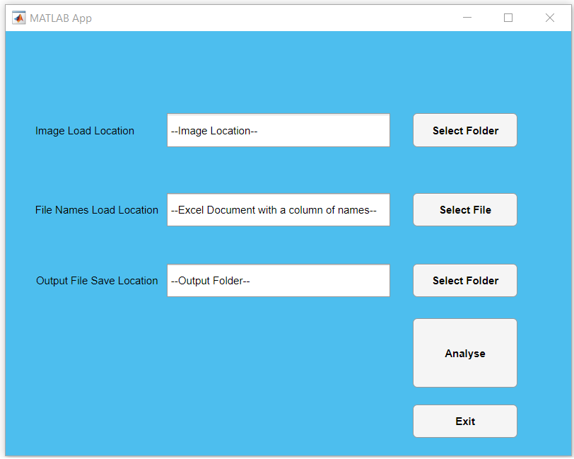

# files_to_list_of_expected_files_comparison_matlab
A MATLAB GUI/app and script for comparing the contents of one directory (of files) with a list of expected file names.

The program takes an input directory containing files and a separate file containing a list of expected file names, and outputs a file containing a list of missing files from the list and extra files from the file directory.

A user interface can be used in the form of a MATLAB app to direct the load and save directories:

